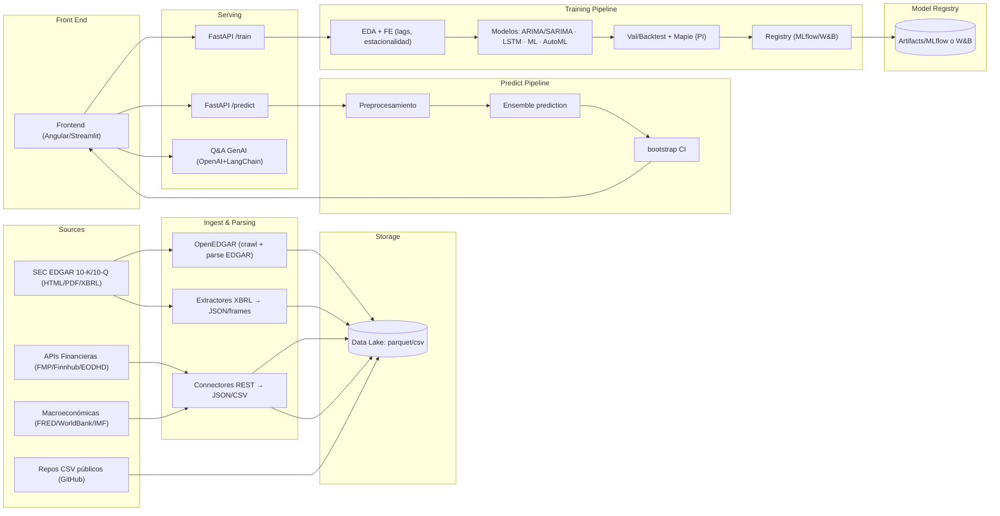
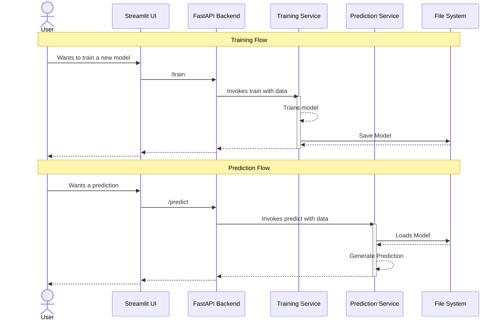
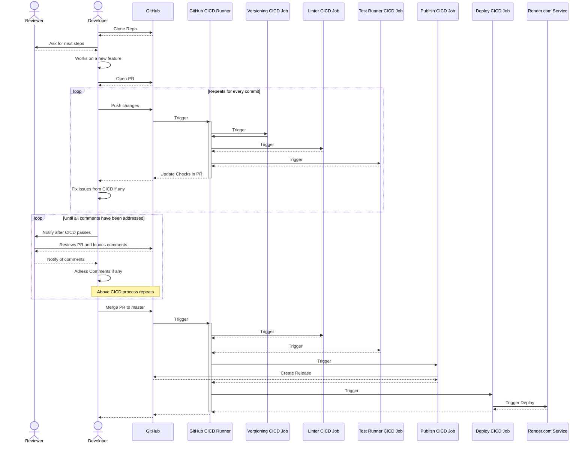

# CFO Copilot

In the current landscape, finance departments and especially CFOs face 
significant challenges in data-driven decision making. CFO Copilot was created 
to optimize financial analysis through generative artificial intelligence 
(GenAI) and machine learning models.

Finance teams work with massive volumes of financial data and must make 
strategic decisions quickly and with confidence. This tool helps reduce human 
errors by automating information extraction and improving the accuracy of 
financial forecasts based on discrete variables. It also addresses the demands 
of market volatility and regulatory complexity by integrating real-time data and 
delivering reliable predictive analytics.

#### How it works

CFO Copilot automates the collection, structuring, and analysis of financial 
data from business documents (10-K reports, financial statements, annual 
reports) and global economic data APIs. It applies time series models such as 
ARIMA, SARIMA, and LSTM to project economic trends and support financial 
planning. GenAI is also integrated to enable advanced queries on charts and 
reports, providing contextual and explanatory answers about the forecasts.

#### Architecture

The solution combines Generative AI for information extraction with advanced 
Machine Learning models for time series forecasting.

GenAI (OpenAI, Gemini, Claude 3.5) interprets and extracts data from 
unstructured documents.

AutoML (PyCaret, StatsForecast) together with ARIMA and LSTM generates financial 
forecasts from the collected data.

NLP and GenAI enable interactive queries, making financial projections and 
charts easier to interpret.

#### Benefits

* Reduced time required for financial analysis
* Greater accuracy in economic forecasts
* Automation of manual processes
* Elimination of human errors through structured handling of unstructured data
* Integration with global financial data APIs
* Scalable design with modular components for corporations, SMBs, and government entities

### High Level architecture diagram

The following diagram illustrates the high-level architecture of the CFO Copilot 
system, including the various components and their interactions.



# Template for AI/ML Projects

[](https://sonarcloud.io/summary/overall?id=leonardoheis_CFO_Copilot)

This is a template that provides the minimal scaffolding to support ML projects
including CICD, deployment and multi-layered architecture.

## Getting Started 

1. Install the UV package manager with `pip install uv==0.8.9`. Pipx can be used
as well.
1. Install dependencies with `uv sync --all-groups`.

### Running tests

Tests can be run via the terminal or through the VS Code Testing Pane.

To run them from the terminal use this command:

```
uv run poe test
```

Check the coverage percentage, the CICD pipeline will fail if it is lower than
100%.

### Linters and formatters

There are multiple linters and formaters in this project.

To run them from the terminal use this command:

```
uv run poe format
```

### Serve the app

The app consists of two independent servers, one for the backend API and one for
the frontend. They can be executed independently or jointly. By using the
following commands:

Backend + Frontend:

```
uv run poe serve
```

Backend Only:

```
uv run poe serve-api
```
For API Access you can visualize the OpenAPI documentation at `http://localhost:8000/docs`.

Frontend Only:

```
uv run poe serve-ui
```
For Streamlit you can visualize the app at `http://localhost:100008501`.

### Deployment

Render.com is used as deployment platform, to ensure the deploy will be
successful. It is recommended to build and run docker locally when
troubleshooting issues.

Build the docker image with

```
uv run poe docker-build
```

Before running, ensure there is a `.env` with relevant environment variables
defined. Then, run the docker image with:

```
uv run poe docker-run
```

The deployment to render occurs on every commit to the default branch.

## Secundary tools and configurations you need to consider

* SonarQube: first register your project in SonarQube, if you don't have an 
account you can create one, and you should configure a webhook to trigger 
analysis on each push.
    * Review this documentation for more details: [SonarQube Documentation](https://docs.sonarqube.org/latest/analysis/scan/)
    * Integrate with your Github CI/CD pipeline for automated quality checks.
        * It is imperative to configure this variables within Github Actions 
        secrets:
            * `SONAR_TOKEN` (this token you need to add it in Project - Settings -
                Security - Secrets and variables - Actions - New repository secret)
            * This token you can find it in your SonarQube account settings. For 
                this open SonarQube and go to My Account - Security - Generate 
                Tokens and create a new one.
            * Grab the SonarQube Key, you will need it later.

* Wakatime: Wakatime is a tool that helps you track your coding activity. 
You can sign up for an account and get an API key, which you will need to 
configure in your development environment. This API Key will be used with the
VS Code extension you should install. When you install this extension it will 
request your API Key.

* Render: You will need to configure your Render account to work with the 
application. This includes setting up the necessary environment variables and 
deployment settings. For this project you need to create a new Web Service using 
the free tier.
    * Create some Actions Variables like for SonarQube:
        * `RENDER_SERVICE_ID` (this service id you need to add it to github 
            Actions: Project - Settings - Security - Secrets and variables - 
            Actions - New repository secret)
            This service id you can find it in your Render account. For this open
            your Render dashboard and navigate to the Service ID.
        * `RENDER_API_KEY` (this API key you need to add it to github Actions:  
            Project - Settings - Security - Secrets and variables - Actions - 
            New repository secret)
            This API key you can find it in your Render account. For this open
            your Render dashboard and navigate Account Settings and then search
            for API Keys. You will need to create a new key for this.

* Github PAT: You will need a GitHub Personal Access Token (PAT) to authenticate 
with the Render. You can create a PAT by going to your GitHub account settings, 
then Developer settings, and finally Personal access tokens. Make sure to grant 
the necessary permissions, in this case Read and Write for Contributors.
    * Create an Actions Variable like for SonarQube:
        * `PUSH_TOKEN` (this PAT you need to add it to github Actions: Project - 
            Settings - Security - Secrets and variables - Actions - New 
            repository secret)
            This PAT is what you created in the previous step and will give you
            the necessary permissions to generate a new release version.

* Lint and Test hardcode values you need to change. You need to change two values:
    1. The `Dsonar.organization` in the `.github/workflows/lint_and_test.yml` 
    file. The value you need to change should have the GitHub organization you 
    have.
    2. The `Dsonar.projectKey` in the `.github/workflows/lint_and_test.yml` 
    file. This value should be composed by:
        * `<organization>_<repository>`

## Understanding data flow

The following sequence diagram shows the data flow in the application.



### CI/CD Flow

Below is an expanded sequence diagram illustrating the CI/CD flow implemented using GitHub Actions. It distinguishes between the workflows triggered by a Pull Request (PR) and those triggered by merging to the `master` branch:


