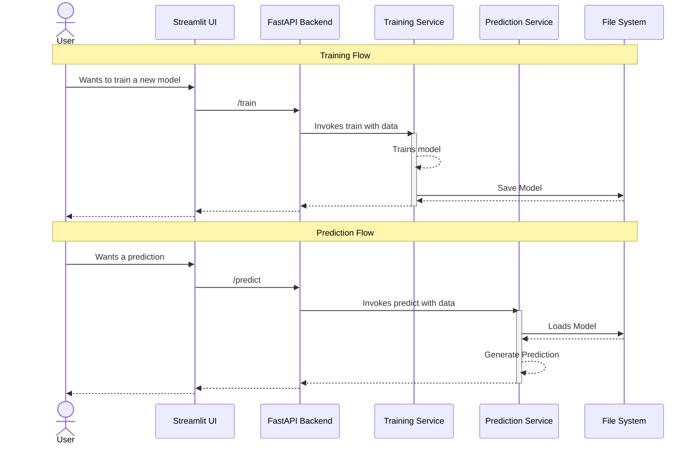

# FastApi Template for ML Projects

[](https://sonarcloud.io/summary/new_code?id=ELC_fastapi-production-template)

This is a template that provides the minimal scaffolding to support ML projects
including CICD, deployment and multi-layered architecture.

## Getting Started

1. Fork the repo.
1. Protect the default branch.
1. Install the UV package manager with `pip install uv==0.8.9`. Pipx can be used
as well
1. Install dependencies with `uv sync --all-groups`.

### Running tests

Tests can be run via the terminal or through the VS Code Testing Pane.

To run them from the terminal use this command:

```
uv run poe test
```

Check the coverage percentage, the CICD pipeline will fail if it is lower than
100%.

### Linters and formatters

There are multiple linters and formaters in this project.

To run them from the terminal use this command:

```
uv run poe format
```

### Serve the app

The app consists of two independent servers, one for the backend API and one for
the frontend. They can be executed independently or jointly. By using the
following commands:

Backend + Frontend:

```
uv run poe serve
```

Backend Only:

```
uv run poe serve-api
```

Frontend Only:

```
uv run poe serve-ui
```

### Deployment

Render.com is used as deployment platform, to ensure the deploy will be
successful. It is recommended to build and run docker locally when
troubleshooting issues.

Build the docker image with

```
uv run poe docker-build
```

Before running, ensure there is a `.env` with relevant environment variables
defined. Then, run the docker image with:

```
uv run poe docker-run
```

The deployment to render occurs on every commit to the default branch.

## Understanding data flow

The following sequence diagram shows the data flow in the application.


