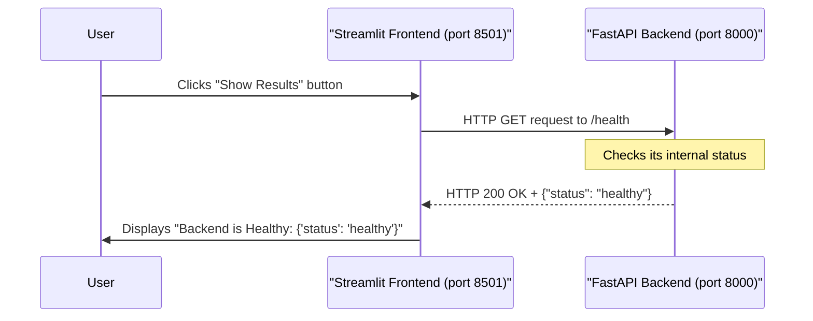

# Chapter 1: Streamlit Frontend

Imagine you've built a super powerful machine learning application – a brilliant brain that can predict things or make smart decisions. Now, how do you let people use this brain without them needing to write code or understand complicated technical details? You need a friendly way for them to interact with it!

That's where the **Streamlit Frontend** comes in. Think of your entire application as a fantastic restaurant. The Streamlit Frontend is like the **dining room** where customers (your users) can easily place their orders (input data), trigger actions (like "train model" or "get prediction"), and see their delicious meals (view results). They don't need to know how the kitchen (your backend) operates; they just want to enjoy the experience!

In our `fastapi-production-template` project, the Streamlit Frontend provides this user-friendly web interface. It runs completely separate from the core "kitchen" (our [FastAPI Backend](02_fastapi_backend_.md)), offering interactive pages for a smooth user experience.

## What is Streamlit?

At its heart, **Streamlit** is an amazing Python library that lets you create beautiful, interactive web applications with pure Python code, and very little effort. You don't need to know HTML, CSS, or JavaScript! It's perfect for quickly building tools for data scientists, engineers, or anyone who needs a simple interface to a complex application.

## How Our Frontend Works (The User Experience)

When you run our `fastapi-production-template` project, one of the first things that happens is the Streamlit Frontend starting up. It usually opens in your web browser, typically at an address like `http://localhost:8501`.

Once open, you'll see different pages and controls. For instance, you might see a "Health Page" where you can click a button to check if the main application (the backend) is running smoothly. When you click that button, Streamlit sends a request to the backend and displays the result right on the page.

Let's look at the special function that kicks off our Streamlit application.

### Running the Streamlit App

The `src/app/frontend/__init__.py` file contains a function named `run_streamlit`. This function is responsible for launching the Streamlit server.

```python
# File: src/app/frontend/__init__.py

import subprocess  # Used to run system commands
import sys

from app.settings import Settings # We'll learn about Settings later!

def run_streamlit() -> None:
    # This command starts our Streamlit application!
    subprocess.run(
        [
            sys.executable, # Use the current Python interpreter
            "streamlit",    # The command to run Streamlit
            "run",          # Tells Streamlit to run a specific file
            str(Settings.UI_ENTRYPOINT), # Our main Streamlit app file (e.g., home.py)
            "--server.port",
            str(Settings.UI_PORT), # The port it will run on (e.g., 8501)
            "--server.headless",
            "true", # Runs Streamlit without automatically opening a browser tab
        ],
        check=True, # Make sure the command runs without errors
    )
```

**Explanation:**
This `run_streamlit` function is like the "host" of our restaurant, making sure the dining room (Streamlit app) is open for business. It uses `subprocess.run` to execute a command, just as if you typed `streamlit run home.py` in your terminal.
*   `sys.executable` makes sure we use the correct Python environment.
*   `"streamlit"` is the command for the Streamlit tool.
*   `"run"` tells Streamlit to execute a Python file.
*   `Settings.UI_ENTRYPOINT` tells Streamlit *which* Python file is our main application (which turns out to be `src/app/frontend/home.py`). We'll dive into `Settings` in a later chapter: [Application Settings](07_application_settings_.md).
*   `--server.port` specifies which network port Streamlit should use (e.g., `8501`).
*   `--server.headless "true"` means Streamlit won't automatically open a new browser tab, which is useful in automated environments.

## Inside Our Streamlit Frontend (The Kitchen Tour of the Dining Room)

Let's peek behind the scenes to see how our Streamlit Frontend is structured.

### The Main Application Entry Point

The `src/app/frontend/home.py` file is the main entry point for our Streamlit application. This is the file that `run_streamlit` tells Streamlit to run.

```python
# File: src/app/frontend/home.py

import streamlit as st # The Streamlit library
from app.frontend.pages import PAGES # Our list of all available pages

def main() -> None:
    # This creates the navigation sidebar in our Streamlit app
    # It takes the list of pages we defined in 'PAGES'
    pg = st.navigation(PAGES)
    # This command actually displays the selected page to the user
    pg.run()

if __name__ == "__main__":
    main() # Run the main function when the script starts
```

**Explanation:**
This `home.py` file sets up the overall structure of our Streamlit app.
*   `st.navigation(PAGES)` is a special Streamlit command that creates a navigation menu (usually a sidebar) where users can switch between different parts of your application. `PAGES` is a list of all the different "sections" or "pages" in our app.
*   `pg.run()` then displays the content of the currently selected page.

### Defining Pages for Navigation

So, where does `PAGES` come from? It's defined in `src/app/frontend/pages/__init__.py`. This file lists all the different screens or functionalities available in our Streamlit application.

```python
# File: src/app/frontend/pages/__init__.py

from collections.abc import Sequence
import streamlit as st
from streamlit.navigation.page import StreamlitPage

# Import the actual functions that define each page's content
from .health import health_page
from .test import test_page

# This tuple lists all the pages in our Streamlit application
PAGES: Sequence[StreamlitPage] = (
    # Each st.Page links a Python function to a menu item
    st.Page(health_page, title="Health Page", icon=":material/favorite:"),
    st.Page(test_page, title="Test Page", icon=":material/check_circle:"),
)
```

**Explanation:**
Here, we import Python functions (`health_page`, `test_page`) that contain the actual code for each page. Then, `PAGES` is a list of `st.Page` objects. Each `st.Page` object links one of these functions to a title and an optional icon that will appear in the navigation menu. So, when a user clicks "Health Page" in the sidebar, Streamlit calls the `health_page()` function and displays whatever it creates.

### An Example Page: The Health Check

Let's look at `src/app/frontend/pages/health.py` to see how a single Streamlit page interacts with our application's "kitchen" (the [FastAPI Backend](02_fastapi_backend_.md)).

```python
# File: src/app/frontend/pages/health.py

import requests # A library for making HTTP requests (talking to web services)
import streamlit as st # The Streamlit library

# The address of our FastAPI Backend's health check endpoint
API_BASE_URL = "http://localhost:8000/health"

def health_page() -> None:
    st.write("# Health Page") # Display a big title on the page

    # Create a button. The code below it only runs when the button is clicked.
    if not st.button("Show Results"):
        return # If the button hasn't been clicked, stop here.

    # When the button IS clicked:
    try:
        # Make a GET request to our FastAPI backend's health endpoint
        response = requests.get(API_BASE_URL, timeout=5)

        # Check if the request was successful (status code 200)
        if response.ok:
            st.success(f"Backend is Healthy: {response.json()}")
        else:
            # If there was an error, display it
            st.error(f"Error checking health: {response.status_code} - {response.text}")
    except requests.exceptions.RequestException as e:
        st.error(f"Could not connect to backend: {e}")

```

**Explanation:**
This `health_page` function is what runs when a user navigates to the "Health Page".
*   `st.write("# Health Page")` simply displays a title on the web page.
*   `st.button("Show Results")` creates an interactive button. The code inside the `if` statement *only* runs when this button is clicked.
*   `requests.get(API_BASE_URL, timeout=5)` is the crucial part! This is how our Streamlit Frontend (the dining room) sends an "order" to the [FastAPI Backend](02_fastapi_backend_.md) (the kitchen). It asks the backend if it's "healthy" by sending a request to `http://localhost:8000/health`.
*   `response.ok`, `st.success`, and `st.error` are Streamlit commands that display messages to the user based on whether the backend responded successfully or with an error.

### How the Frontend and Backend Talk

Let's visualize the interaction when you click the "Show Results" button on the Health Page:



This diagram shows that the Streamlit Frontend doesn't do any heavy lifting itself regarding the application's core logic. Its job is to collect user input, send requests to the [FastAPI Backend](02_fastapi_backend_.md), and then display the results it receives back.

## Conclusion

In this chapter, we've explored the **Streamlit Frontend**, understanding its role as the user-friendly interface for our application. We learned that:

*   Streamlit allows us to build interactive web UIs using only Python.
*   The `run_streamlit` function launches our Streamlit application.
*   Our application uses `st.navigation` to organize different "pages."
*   Individual pages, like `health_page`, interact with the [FastAPI Backend](02_fastapi_backend_.md) by sending HTTP requests and displaying the results.

The Streamlit Frontend provides the "face" of our application, making it accessible to users. But what about the powerful "brain" that actually processes requests and runs our machine learning models? That's the job of the [FastAPI Backend](02_fastapi_backend_.md)!

In the next chapter, we'll dive into the [FastAPI Backend](02_fastapi_backend_.md), understanding how it acts as the "kitchen" that prepares and serves the application's core logic.

[Next Chapter: FastAPI Backend](02_fastapi_backend_.md)

---

<sub><sup>Generated by [AI Codebase Knowledge Builder](https://github.com/The-Pocket/Tutorial-Codebase-Knowledge).</sup></sub> <sub><sup>**References**: [[1]](https://github.com/ELC/fastapi-production-template/blob/8d61d95c61a9e0906dc47fbcb555fd0503a7de92/src/app/frontend/__init__.py), [[2]](https://github.com/ELC/fastapi-production-template/blob/8d61d95c61a9e0906dc47fbcb555fd0503a7de92/src/app/frontend/home.py), [[3]](https://github.com/ELC/fastapi-production-template/blob/8d61d95c61a9e0906dc47fbcb555fd0503a7de92/src/app/frontend/pages/__init__.py), [[4]](https://github.com/ELC/fastapi-production-template/blob/8d61d95c61a9e0906dc47fbcb555fd0503a7de92/src/app/frontend/pages/health.py)</sup></sub>