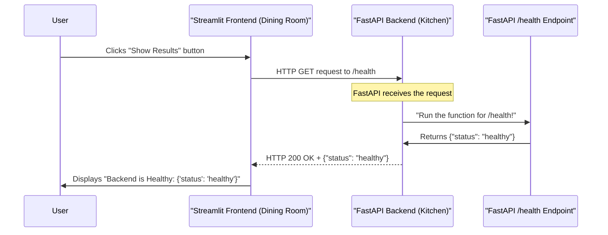

# Chapter 2: FastAPI Backend

In the last chapter, we imagined our application as a fantastic restaurant, and the [Streamlit Frontend](01_streamlit_frontend_.md) was the friendly "dining room" where customers (users) place their orders and see their meals. But where does the actual cooking happen? Where are those orders processed and transformed into delicious dishes?

That's the job of the **FastAPI Backend**!

## What is the FastAPI Backend? (The Kitchen)

The FastAPI Backend is the core "kitchen" of our application. It's an API server that runs separately from the Streamlit frontend. Its main responsibilities are:

1.  **Receiving Orders (Requests):** It listens for requests (orders) coming from the frontend or any other application.
2.  **Processing Orders:** It performs the actual work – whether it's checking system health, running complex machine learning predictions, or even training a model. This is where the "brains" of our application reside.
3.  **Delivering Dishes (Responses):** After processing, it sends back the results (the prepared "dishes") in a structured format, usually JSON, so the requesting application (like our Streamlit frontend) can understand and display them.

Think of it as the expert chef and kitchen staff. They don't interact directly with customers; they just focus on getting the food right based on the orders they receive.

## Our First Order: Checking System Health

Remember the "Health Page" in our Streamlit frontend? When you clicked the "Show Results" button, Streamlit sent an "order" to the backend. That order was a request to check if the kitchen (FastAPI Backend) was up and running smoothly.

Let's see how FastAPI handles this specific "order."

### Defining Endpoints (The Menu Items)

In FastAPI, each "order" or action that the backend can perform is called an **endpoint**. An endpoint is a specific URL that corresponds to a particular function. It's like a menu item in our restaurant. For example:

*   `/health`: "Are you healthy?"
*   `/prediction/predict`: "Please give me a prediction!"
*   `/prediction/train`: "Please train the model!"

When our Streamlit frontend asks `/health`, it's requesting the "Are you healthy?" menu item.

### Receiving and Responding to the Health Check

Here's how our FastAPI backend defines the `/health` endpoint and responds to the Streamlit frontend's request:

```python
# File: src/app/api/routes/health.py (simplified for clarity)

from fastapi import APIRouter # Tool for creating groups of endpoints

# Create a 'router' to group our health-related endpoints
health_router = APIRouter()

@health_router.get("/health") # This tells FastAPI: "If someone asks for GET /health..."
def get_health() -> dict[str, str]:
    # ...then run this function and return this dictionary.
    return {"status": "healthy"}
```

**Explanation:**

*   `from fastapi import APIRouter`: We import `APIRouter`, which is like a section of our menu (e.g., "Appetizers"). We can group related endpoints together.
*   `health_router = APIRouter()`: We create an instance of our "health" menu section.
*   `@health_router.get("/health")`: This is a special decorator that tells FastAPI: "Whenever an application sends an **HTTP GET request** to the `/health` URL, run the Python function right below this line."
    *   `GET` is one of the common "methods" for HTTP requests, typically used for asking for information.
*   `def get_health() -> dict[str, str]:`: This is the Python function that gets executed. It simply returns a Python dictionary `{"status": "healthy"}`.
*   FastAPI automatically converts this Python dictionary into a **JSON response** and sends it back to the client (our Streamlit frontend).

**Example Interaction:**

1.  **Request from Streamlit:** `GET http://localhost:8000/health`
2.  **Response from FastAPI:**
    ```json
    {
        "status": "healthy"
    }
    ```

This simple interaction demonstrates the core concept: a client (frontend) sends a request to a specific URL (endpoint) on the backend, and the backend processes it and sends back a structured response.

## How the FastAPI Backend is Structured (The Kitchen Layout)

Our `fastapi-production-template` organizes the FastAPI Backend in a clean and logical way.

### 1. The Main FastAPI Application

The heart of our backend is created in `src/app/api/app.py`. This file contains the function that sets up our main FastAPI application.

```python
# File: src/app/api/app.py

from fastapi import FastAPI # The main FastAPI library

# This function creates and configures our FastAPI application
def create_app() -> FastAPI:
    app = FastAPI(title="FastAPI Production Template") # Give our API a name

    # Add all the different "menu sections" (routers) to our main app
    from .routes import ROUTERS
    for router in ROUTERS:
        app.include_router(router)

    # We also add error handlers here, but we'll learn about those later!
    # from .error_handlers import EXCEPTION_HANDLERS
    # for exception, exception_handler in EXCEPTION_HANDLERS.items():
    #    app.add_exception_handler(exception, exception_handler)

    return app # Return the fully set up FastAPI application
```

**Explanation:**
*   `app = FastAPI(...)`: This line creates the main FastAPI application instance. It's like saying, "Here's our kitchen ready to be equipped!"
*   `app.include_router(router)`: This is crucial. It tells our main FastAPI application to include all the endpoints defined in our various "menu sections" (like `health_router`, `prediction_router`, etc.). Without this, FastAPI wouldn't know about our `/health` endpoint!

### 2. Organizing Endpoints with Routers

Just like a good restaurant groups menu items (e.g., "Appetizers," "Main Courses," "Desserts"), FastAPI uses `APIRouter` to group related endpoints. This helps keep our code organized.

The `src/app/api/routes/__init__.py` file lists all these different groups:

```python
# File: src/app/api/routes/__init__.py

from collections.abc import Iterable
from fastapi import APIRouter

# Import specific routers (menu sections)
from .health import health_router      # Our health check endpoints
from .prediction import prediction_router # Prediction endpoints
from .train import train_router        # Training endpoints

# This list holds all our 'menu sections' (APIRouters)
ROUTERS: Iterable[APIRouter] = (
    health_router,
    prediction_router,
    train_router,
)
```

**Explanation:**
*   This file acts as a central index for all the `APIRouter` instances we define.
*   Each `from .health import health_router` imports a specific router (like the one we saw for `/health`).
*   The `ROUTERS` tuple then combines them all, making it easy for the `create_app` function to add them to the main FastAPI application.

### The Full Request-Response Flow for Health Check

Let's trace the journey of a health check request from the user's perspective all the way through our backend and back:



This diagram shows that the FastAPI Backend (the kitchen) is the central processing unit. It receives requests, directs them to the correct "chef" (endpoint function), and sends back the result.

## Conclusion

In this chapter, we've explored the **FastAPI Backend**, understanding its crucial role as the "kitchen" of our application. We learned that:

*   It acts as the core API server, processing requests from the frontend or other services.
*   **Endpoints** are specific URLs that define actions the backend can perform, like `/health`.
*   FastAPI uses Python functions, decorated with `@router.get("/path")` (or `post`, `put`, etc.), to define these endpoints.
*   The `create_app` function initializes the FastAPI application, and `APIRouter` helps organize endpoints.

The FastAPI Backend provides the powerful "brain" and "muscle" of our application, but it often needs help to perform complex tasks, especially machine learning. In the next chapter, we'll peel back another layer and explore the [Machine Learning Services](03_machine_learning_services_.md), which are the specialized chefs within our kitchen responsible for the actual ML tasks!

[Next Chapter: Machine Learning Services](03_machine_learning_services_.md)

---

<sub><sup>Generated by [AI Codebase Knowledge Builder](https://github.com/The-Pocket/Tutorial-Codebase-Knowledge).</sup></sub> <sub><sup>**References**: [[1]](https://github.com/ELC/fastapi-production-template/blob/8d61d95c61a9e0906dc47fbcb555fd0503a7de92/src/app/api/app.py), [[2]](https://github.com/ELC/fastapi-production-template/blob/8d61d95c61a9e0906dc47fbcb555fd0503a7de92/src/app/api/dependencies.py), [[3]](https://github.com/ELC/fastapi-production-template/blob/8d61d95c61a9e0906dc47fbcb555fd0503a7de92/src/app/api/error_handlers/__init__.py), [[4]](https://github.com/ELC/fastapi-production-template/blob/8d61d95c61a9e0906dc47fbcb555fd0503a7de92/src/app/api/routes/__init__.py), [[5]](https://github.com/ELC/fastapi-production-template/blob/8d61d95c61a9e0906dc47fbcb555fd0503a7de92/src/app/api/routes/prediction/endpoints.py), [[6]](https://github.com/ELC/fastapi-production-template/blob/8d61d95c61a9e0906dc47fbcb555fd0503a7de92/src/app/api/routes/train/endpoints.py)</sup></sub>