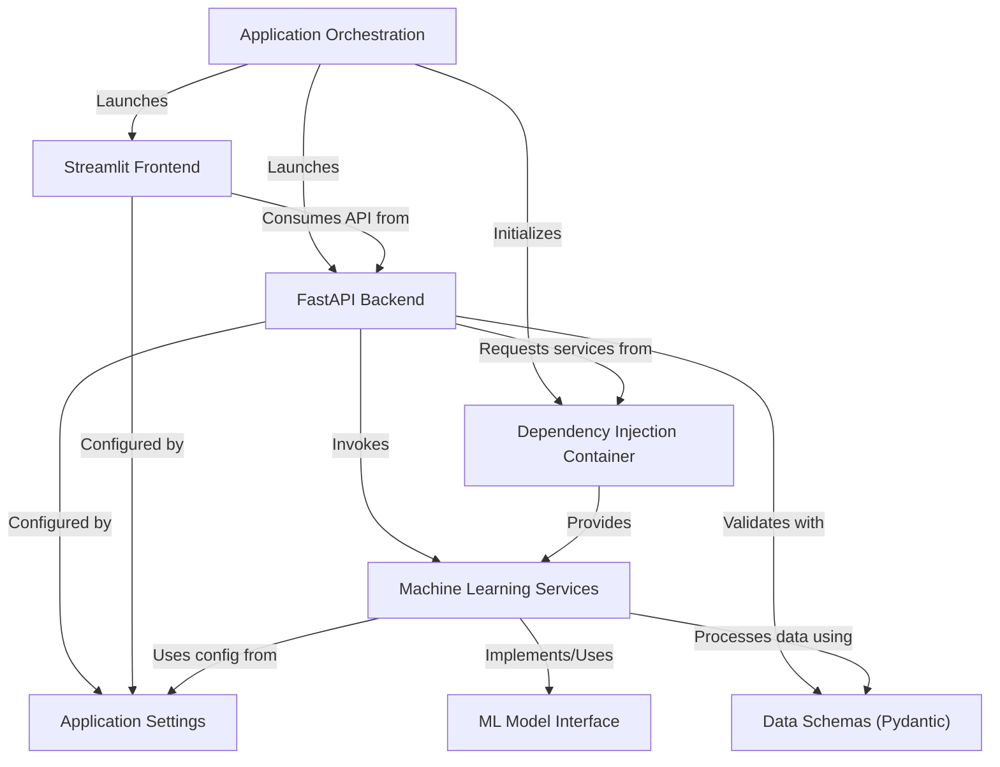

# Tutorial: fastapi-production-template

This project is a *production-ready template* for a **machine learning application**. It allows users to interact with an ML model in two ways: through a **FastAPI backend** that provides an API for predictions and training, and via a user-friendly **Streamlit frontend** for interactive control. The system ensures that both the API and the UI run smoothly together to deliver intelligent functionalities.

## Visual Overview

## Chapters

1. [Streamlit Frontend
](01_streamlit_frontend_.md)
2. [FastAPI Backend
](02_fastapi_backend_.md)
3. [Machine Learning Services
](03_machine_learning_services_.md)
4. [ML Model Interface
](04_ml_model_interface_.md)
5. [Data Schemas (Pydantic)
](05_data_schemas__pydantic__.md)
6. [Application Orchestration
](06_application_orchestration_.md)
7. [Application Settings
](07_application_settings_.md)
8. [Dependency Injection Container
](08_dependency_injection_container_.md)

---

Generated by [AI Codebase Knowledge Builder](https://github.com/The-Pocket/Tutorial-Codebase-Knowledge).